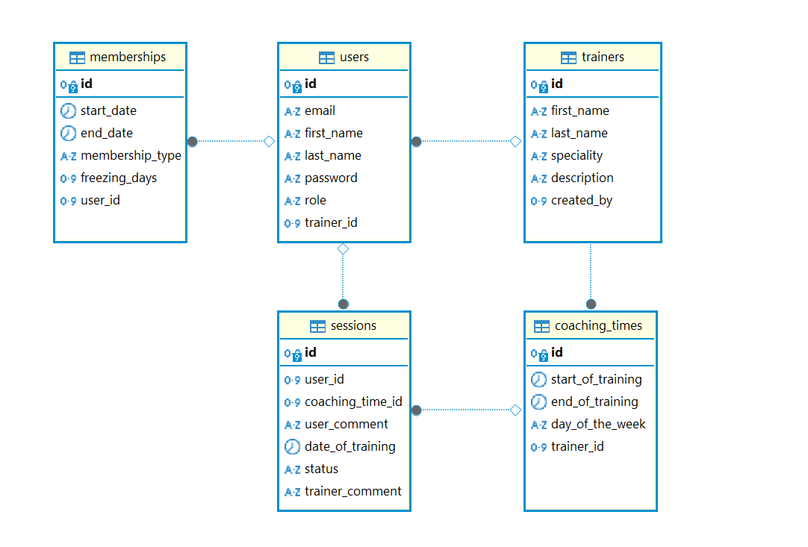

# REST API для тренажерного зала

## Содержание

    1. Описание проекта

    2. Описание сущностей

    3. Подготовка к запуску приложения

    4. Схема структуры базы данных

    5. Использованные технологии и их версии

## 1. Описание проекта

Этот проект представляет собой систему управления для тренажерного зала, содержащую следующее функции:

### - Основные функции доступные для всех пользователей с активным абонементом:

1) Просмотр информации обо всех тренерах работающих в тренажерном зале
2) Просмотр расписания тренеров
3) Выбор основного тренера, к которому вы будете ходить на тренировки 
4) Запись на тренировку к тренеру на выбранное пользователем число и время
5) Получение писем на электронную почту с предупреждением об окончании действия абонемента

### - Основные функции для тренеров (так же тренерам доступны функции, что и обычным пользователям):

1) Создание тренерского профиля, где тренер может указать свою специализацию, а так же добавить информацию о себе  
2) Создание личного расписания на неделю, с не ограниченным временем работы
3) Изменение своего расписания
4) Просмотр запланированных или уже проведенных тренировок с пользователями
5) Добавление комментария к тренировке с пользователем
6) Изменение статуса тренировки
7) Исключение участника из списка пользователей занимающихся у тренера

## 2. Описание сущностей:

#### Пользователь (User) - содержит информацию о пользователе.
#### Тренер (Trainer) - содержит информацию о тренере
#### Запись в расписании тренера (CoachingTime) - запись о начале и конце тренировке, используемая в расписании тренера
#### Абонемент (Membership) - абонемент дающий доступ к занятиям в тренажерном зале, и различным функциям в приложении 
#### Тренировочная сессия (Session) - сущность для записи пользователя на тренировку 

## 3. Подготовка к запуску приложения
Для того чтобы запустить приложение выполните все шаги описанные ниже:

1. Клонируем проект - https://github.com/ekwqOdnjw9qjr/GymTreaker.git
2. Убедитесь что Java 21
3. Введите свои  данные для Postgres в resources/application.yaml
4. Запустите приложение перейдите по адресу http://localhost:8086/ или http://localhost:8086/swagger-ui/index.html# для swagger

### Данные для входа в аккаунт с ролью admin, для выдачи ролей, а также доступа к расширенному пакету функций
Для входа в систему используйте следующие данные:
- **Электронная почта**: `zxc@gmail.com`
- **Пароль**: `zxc`

### 4. Схема структуры базы данных

)

### 5. Использованные технологии и их версии

*Spring Boot* - `3.3.1`

*Java* - `21`

*MapStruct* - `1.5.5.Final`

*Lombok* - `1.18.32`

*Liquibase* -  `4.29.1`

*PostgreSQL* - `42.7.3`

*H2 Database* - `2.2.224`

